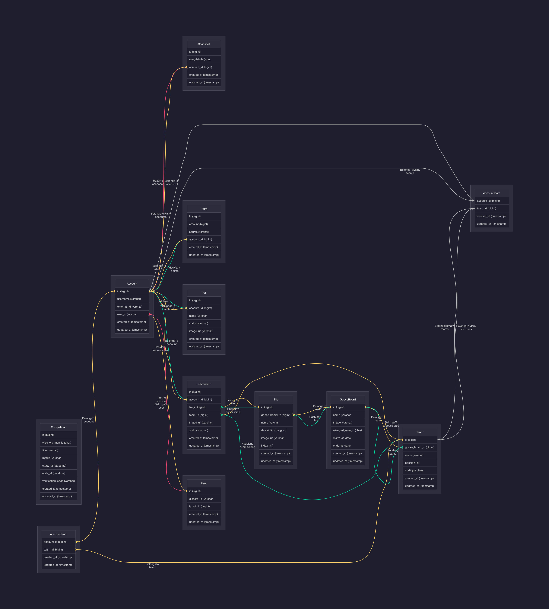

[](https://github.com/Opblaasmaatje/Line/actions/workflows/style.yml)
[](https://github.com/Opblaasmaatje/Line/actions/workflows/phpstan.yml)
[](https://github.com/Opblaasmaatje/Line/actions/workflows/tests.yml)

Discord bot to track sereval things with

# Installation guide

## Install dependencies
```bash
$ composer install
```

### Copy .example.env and configure accordingly

### Migrate DB

```bash
$ php laracord migrate
```

### Run bot

```bash
$ laracord
```

## Data structure

