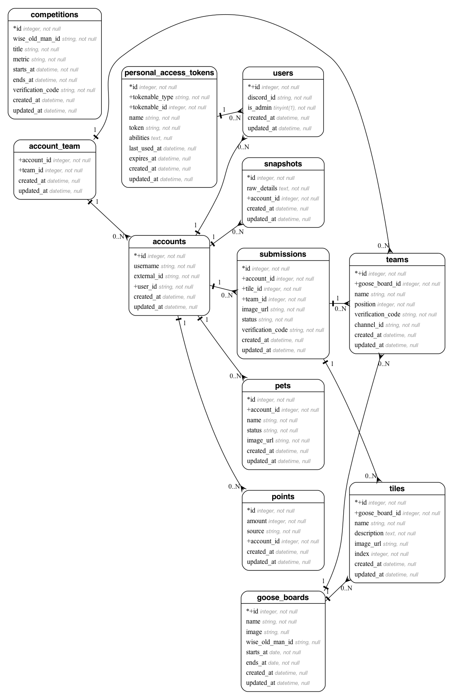

[](https://github.com/Opblaasmaatje/Line/actions/workflows/style.yml)
[](https://github.com/Opblaasmaatje/Line/actions/workflows/phpstan.yml)
[](https://github.com/Opblaasmaatje/Line/actions/workflows/tests.yml)

# Line

Discord bot for managing and tracking Old School RuneScape (OSRS) clan data, built on Laracord (Laravel Zero-based) and integrating with Wise Old Man.

Note: This README reflects the current repository state. Unknowns are explicitly marked as TODOs.

## Overview
- Tech stack: PHP 8.4, Composer, Laracord framework (Laravel Zero style), Symfony Console, PHPUnit, PHPStan, Laravel Pint, Easy Coding Standard (ECS).
- Entry point: ./laracord (CLI).
- Packaging: box.json present for PHAR builds (see Packaging section).
- Database: Laravel-style migrations supported.

## Requirements
- PHP: ^8.4
- Composer
- Extensions: Standard PHP extensions required by dependencies (see composer install for any missing ext- errors).
- Database: A supported database configured via Laravel config (e.g., SQLite/MySQL/PostgreSQL). TODO: Document the default driver used by this project.

## Setup
1. Clone the repository.
2. Install PHP dependencies:
   ```bash
   composer install
   ```
3. Initialize environment:
   ```bash
   cp .env.example .env
   # Fill in required values (see Environment variables)
   ```
4. Generate app key (if required by Laracord components). TODO: Confirm whether an app key is required.
5. Configure your database in .env (see Laravel database configuration). TODO: Document the expected DB connection.
6. Run database migrations (if used by your commands):
   ```bash
   ./laracord migrate
   # or
   php laracord migrate
   ```

## Running the bot
- Start the CLI application (will run the default Laracord command or your custom commands):
  ```bash
  ./laracord
  ```
- List available commands:
  ```bash
  ./laracord list
  ```
- Example: run a specific command (replace with your command name):
  ```bash
  ./laracord your:command
  ```

## Scripts and developer tooling
These tools are available via Composer-installed binaries:
- Tests:
  ```bash
  vendor/bin/phpunit
  ```
- Static analysis (PHPStan):
  ```bash
  vendor/bin/phpstan analyse
  ```
- Coding standards (ECS):
  ```bash
  vendor/bin/ecs check
  vendor/bin/ecs fix   # to fix automatically
  ```
- Code style (Pint):
  ```bash
  vendor/bin/pint
  ```

Composer scripts:
- post-root-package-install will copy .env.example to .env if .env does not exist.

## Environment variables
From .env.example:
- APP_NAME=Laracord
- APP_ENV=development
- DISCORD_TOKEN= (Discord bot token)
- WISE_OLD_MAN_API_KEY=
- WISE_OLD_MAN_GROUP_ID=001
- WISE_OLD_MAN_GROUP_CODE=001
- PET_REVIEW_CHANNEL=

Notes:
- Provide valid Discord credentials for the bot to authenticate.
- Configure any DB_* variables if your features use the database. TODO: List exact DB vars once confirmed.

## Tests
- Test runner:
  ```bash
  vendor/bin/phpunit
  ```
- Configuration: phpunit.xml at the repo root.
  - Source includes: app/
  - Tests directory in config is "tests".

## Project structure
Top-level of this repository includes:
- app/ — Application code (commands, services, modules)
- bootstrap/ — Framework bootstrap
- config/ — Configuration files
- database/ — Migrations/factories/seeds
- laracord — CLI entry point
- public/ — Public assets (if applicable)
- storage/ — Runtime storage
- tests/ — Test suite (PHPUnit)
- vendor/ — Composer dependencies
- box.json — PHAR packaging configuration
- phpunit.xml — PHPUnit configuration
- phpstan.neon — PHPStan configuration
- ecs.php — ECS configuration
- composer.json — Project metadata and dependencies
- graph.png — Data structure diagram

## Packaging (PHAR)
This project contains a box.json, indicating support for building a PHAR.
- Prerequisite: Install humbug/box (Box) locally or globally. Example (global):
  ```bash
  composer global require humbug/box
  ```
- Build (example):
  ```bash
  box compile
  ```
TODO: Document the exact PHAR build and execution commands once confirmed (stub, output path, and versioning).

## License
- Declared in composer.json as MIT.
- TODO: Add a LICENSE file to the repository to accompany the declared license.

## Diagram
Data structure / ER graph:


